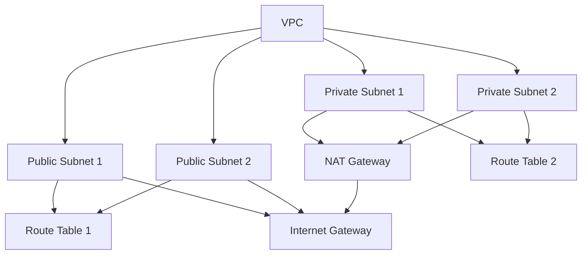

# AWS CLI Guide

## 1. Introduction to AWS CLI

### What is AWS CLI?
The AWS Command Line Interface (CLI) is a unified tool to manage AWS services. It provides direct interaction with AWS services through commands in your command-line shell.

### Installation
```bash
# macOS
brew install awscli

# Linux
curl "https://awscli.amazonaws.com/awscli-exe-linux-x86_64.zip" -o "awscliv2.zip"
unzip awscliv2.zip
sudo ./aws/install

# Windows
# Download MSI installer from AWS website
```

### Configuration
```bash
# Configure AWS CLI
aws configure

# Enter your credentials
AWS Access Key ID: YOUR_ACCESS_KEY
AWS Secret Access Key: YOUR_SECRET_KEY
Default region name: us-east-1
Default output format: json
```

## 2. Basic AWS CLI Commands

### S3 Commands

#### Bucket Operations
```bash
# List buckets
aws s3 ls

# Create bucket
aws s3 mb s3://my-bucket

# Delete bucket
aws s3 rb s3://my-bucket

# List objects in bucket
aws s3 ls s3://my-bucket

# Copy object to bucket
aws s3 cp file.txt s3://my-bucket/

# Download object from bucket
aws s3 cp s3://my-bucket/file.txt ./

# Sync directory with bucket
aws s3 sync ./local-folder s3://my-bucket/

# Remove object from bucket
aws s3 rm s3://my-bucket/file.txt
```

#### Bucket Configuration
```bash
# Enable versioning
aws s3api put-bucket-versioning --bucket my-bucket --versioning-configuration Status=Enabled

# Set bucket policy
aws s3api put-bucket-policy --bucket my-bucket --policy file://policy.json

# Enable server access logging
aws s3api put-bucket-logging --bucket my-bucket --bucket-logging-configuration file://logging.json

# Configure lifecycle rules
aws s3api put-bucket-lifecycle-configuration --bucket my-bucket --lifecycle-configuration file://lifecycle.json
```

### IAM Commands

#### User Management
```bash
# List users
aws iam list-users

# Create user
aws iam create-user --user-name my-user

# Delete user
aws iam delete-user --user-name my-user

# Create access key
aws iam create-access-key --user-name my-user

# Delete access key
aws iam delete-access-key --user-name my-user --access-key-id KEY_ID
```

#### Group Management
```bash
# List groups
aws iam list-groups

# Create group
aws iam create-group --group-name my-group

# Add user to group
aws iam add-user-to-group --user-name my-user --group-name my-group

# Remove user from group
aws iam remove-user-from-group --user-name my-user --group-name my-group
```

#### Policy Management
```bash
# List policies
aws iam list-policies

# Create policy
aws iam create-policy --policy-name my-policy --policy-document file://policy.json

# Attach policy to user
aws iam attach-user-policy --user-name my-user --policy-arn arn:aws:iam::aws:policy/AmazonS3ReadOnlyAccess

# Detach policy from user
aws iam detach-user-policy --user-name my-user --policy-arn arn:aws:iam::aws:policy/AmazonS3ReadOnlyAccess
```

### EC2 Commands

#### Instance Management
```bash
# List instances
aws ec2 describe-instances

# Launch instance
aws ec2 run-instances --image-id ami-12345678 --count 1 --instance-type t2.micro --key-name my-key

# Stop instance
aws ec2 stop-instances --instance-ids i-12345678

# Start instance
aws ec2 start-instances --instance-ids i-12345678

# Terminate instance
aws ec2 terminate-instances --instance-ids i-12345678
```

#### Security Group Management
```bash
# List security groups
aws ec2 describe-security-groups

# Create security group
aws ec2 create-security-group --group-name my-sg --description "My security group"

# Add inbound rule
aws ec2 authorize-security-group-ingress --group-name my-sg --protocol tcp --port 22 --cidr 0.0.0.0/0

# Remove inbound rule
aws ec2 revoke-security-group-ingress --group-name my-sg --protocol tcp --port 22 --cidr 0.0.0.0/0
```

## 3. Practical Demo: VPC Setup

### Network Architecture Diagram


### Step-by-Step Implementation

1. **Create VPC**
```bash
# Create VPC
aws ec2 create-vpc \
    --cidr-block 10.0.0.0/16 \
    --tag-specifications 'ResourceType=vpc,Tags=[{Key=Name,Value=my-vpc}]'

# Store VPC ID
VPC_ID=$(aws ec2 describe-vpcs --filters "Name=tag:Name,Values=my-vpc" --query 'Vpcs[0].VpcId' --output text)
```

2. **Create Subnets**
```bash
# Create public subnets
aws ec2 create-subnet \
    --vpc-id $VPC_ID \
    --cidr-block 10.0.1.0/24 \
    --availability-zone us-east-1a \
    --tag-specifications 'ResourceType=subnet,Tags=[{Key=Name,Value=public-subnet-1}]'

aws ec2 create-subnet \
    --vpc-id $VPC_ID \
    --cidr-block 10.0.2.0/24 \
    --availability-zone us-east-1b \
    --tag-specifications 'ResourceType=subnet,Tags=[{Key=Name,Value=public-subnet-2}]'

# Create private subnets
aws ec2 create-subnet \
    --vpc-id $VPC_ID \
    --cidr-block 10.0.3.0/24 \
    --availability-zone us-east-1a \
    --tag-specifications 'ResourceType=subnet,Tags=[{Key=Name,Value=private-subnet-1}]'

aws ec2 create-subnet \
    --vpc-id $VPC_ID \
    --cidr-block 10.0.4.0/24 \
    --availability-zone us-east-1b \
    --tag-specifications 'ResourceType=subnet,Tags=[{Key=Name,Value=private-subnet-2}]'
```

3. **Create Internet Gateway**
```bash
# Create IGW
aws ec2 create-internet-gateway \
    --tag-specifications 'ResourceType=internet-gateway,Tags=[{Key=Name,Value=my-igw}]'

# Store IGW ID
IGW_ID=$(aws ec2 describe-internet-gateways --filters "Name=tag:Name,Values=my-igw" --query 'InternetGateways[0].InternetGatewayId' --output text)

# Attach IGW to VPC
aws ec2 attach-internet-gateway \
    --vpc-id $VPC_ID \
    --internet-gateway-id $IGW_ID
```

4. **Create NAT Gateway**
```bash
# Allocate Elastic IP
EIP_ID=$(aws ec2 allocate-address --domain vpc --query 'AllocationId' --output text)

# Create NAT Gateway
aws ec2 create-nat-gateway \
    --subnet-id $PUBLIC_SUBNET_1_ID \
    --allocation-id $EIP_ID \
    --tag-specifications 'ResourceType=natgateway,Tags=[{Key=Name,Value=my-nat}]'

# Store NAT Gateway ID
NAT_ID=$(aws ec2 describe-nat-gateways --filter "Name=tag:Name,Values=my-nat" --query 'NatGateways[0].NatGatewayId' --output text)
```

5. **Configure Route Tables**
```bash
# Create public route table
aws ec2 create-route-table \
    --vpc-id $VPC_ID \
    --tag-specifications 'ResourceType=route-table,Tags=[{Key=Name,Value=public-rt}]'

# Create private route table
aws ec2 create-route-table \
    --vpc-id $VPC_ID \
    --tag-specifications 'ResourceType=route-table,Tags=[{Key=Name,Value=private-rt}]'

# Add route to internet gateway
aws ec2 create-route \
    --route-table-id $PUBLIC_RT_ID \
    --destination-cidr-block 0.0.0.0/0 \
    --gateway-id $IGW_ID

# Add route to NAT gateway
aws ec2 create-route \
    --route-table-id $PRIVATE_RT_ID \
    --destination-cidr-block 0.0.0.0/0 \
    --nat-gateway-id $NAT_ID

# Associate route tables with subnets
aws ec2 associate-route-table \
    --subnet-id $PUBLIC_SUBNET_1_ID \
    --route-table-id $PUBLIC_RT_ID

aws ec2 associate-route-table \
    --subnet-id $PUBLIC_SUBNET_2_ID \
    --route-table-id $PUBLIC_RT_ID

aws ec2 associate-route-table \
    --subnet-id $PRIVATE_SUBNET_1_ID \
    --route-table-id $PRIVATE_RT_ID

aws ec2 associate-route-table \
    --subnet-id $PRIVATE_SUBNET_2_ID \
    --route-table-id $PRIVATE_RT_ID
```

### Verification Commands
```bash
# Verify VPC
aws ec2 describe-vpcs --vpc-id $VPC_ID

# Verify subnets
aws ec2 describe-subnets --filters "Name=vpc-id,Values=$VPC_ID"

# Verify route tables
aws ec2 describe-route-tables --filters "Name=vpc-id,Values=$VPC_ID"

# Verify NAT Gateway
aws ec2 describe-nat-gateways --filter "Name=tag:Name,Values=my-nat"
```

## 4. Best Practices

1. **Security**
   - Use IAM roles instead of access keys
   - Implement least privilege access
   - Regularly rotate credentials
   - Use security groups effectively

2. **Cost Management**
   - Monitor resource usage
   - Clean up unused resources
   - Use appropriate instance types
   - Implement auto-scaling

3. **Performance**
   - Choose appropriate regions
   - Use proper instance types
   - Implement caching
   - Optimize network configuration

4. **Maintenance**
   - Keep AWS CLI updated
   - Regularly check for updates
   - Monitor resource health
   - Implement backup strategies 