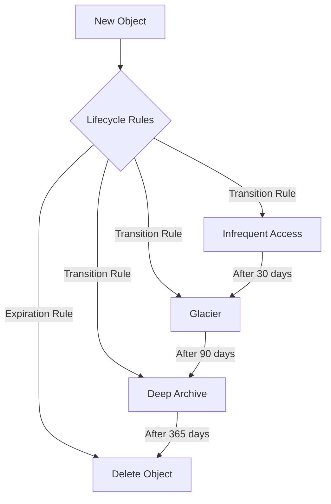

# Amazon S3 Advanced Features and Use Cases

## 1. Versioning
Versioning is a means of keeping multiple variants of an object in the same bucket.

### What is Versioning?
Versioning is a state of an S3 bucket that keeps multiple variants of every object. When versioning is enabled, S3 stores all versions of an object (including all writes and even if you delete an object).

### How it Works:
1. When versioning is enabled, S3 automatically assigns a unique version ID to each object
2. Each version of an object is stored as a separate object
3. When you overwrite an object, S3 creates a new version instead of replacing the existing one
4. When you delete an object, S3 adds a delete marker instead of removing the object
5. All versions of an object can be listed, retrieved, and restored

### Why it's Needed:
1. **Data Protection**
   - Prevents accidental deletion of objects
   - Protects against application errors
   - Guards against malicious attacks

2. **Compliance Requirements**
   - Helps meet regulatory requirements
   - Maintains data retention policies
   - Supports audit trails

3. **Data Recovery**
   - Enables rollback to previous versions
   - Recovers from application errors
   - Restores accidentally deleted objects

### Use Cases:
1. **Document Management System**
   - Track changes to important documents
   - Revert to previous versions if needed
   - Maintain audit trail of modifications

2. **Compliance Requirements**
   - Meet regulatory requirements for data retention
   - Maintain immutable copies of critical data
   - Support legal and audit processes

### Implementation:
```bash
# Enable versioning using AWS CLI
aws s3api put-bucket-versioning --bucket my-bucket --versioning-configuration Status=Enabled
```

## 2. Intelligent-Tiering Archive Configurations
Automatically moves data to the most cost-effective access tier based on access patterns.

### What is Intelligent-Tiering?
Intelligent-Tiering is an S3 storage class that automatically moves data between four access tiers based on changing access patterns. It optimizes storage costs by automatically moving data to the most cost-effective access tier without performance impact or operational overhead.

### How it Works:
1. **Monitoring Phase**
   - Tracks object access patterns
   - Analyzes frequency of access
   - Monitors access timing

2. **Tier Movement**
   - Automatically moves objects between tiers
   - No manual intervention required
   - No performance impact during movement

3. **Access Tiers**
   - Frequent Access: For actively accessed data
   - Infrequent Access: For less frequently accessed data
   - Archive Instant Access: For rarely accessed data
   - Deep Archive: For long-term archival data

### Why it's Needed:
1. **Cost Optimization**
   - Reduces storage costs by up to 95%
   - Eliminates manual tier management
   - Optimizes storage based on actual usage

2. **Performance Requirements**
   - Maintains performance for active data
   - Provides instant access when needed
   - Balances cost and performance

3. **Operational Efficiency**
   - Reduces management overhead
   - Automates storage optimization
   - Simplifies storage management

### Use Cases:
1. **Media Content Management**
   - Store frequently accessed recent content in Frequent Access
   - Move older content to Infrequent Access
   - Archive historical content to Deep Archive

2. **Data Analytics**
   - Keep recent analysis data in Frequent Access
   - Move older datasets to Infrequent Access
   - Archive raw data to Deep Archive

### Cost Optimization:
- Up to 95% cost savings compared to Frequent Access
- No retrieval fees for Intelligent-Tiering
- Automatic optimization based on access patterns

## 3. Server Access Logging
Records detailed information about requests made to your S3 bucket.

### What is Server Access Logging?
Server access logging provides detailed records for the requests that are made to a bucket. Each log record contains details about a single access request, such as the requester, bucket name, request time, request action, response status, and error code.

### How it Works:
1. **Log Generation**
   - Captures all requests to the bucket
   - Records detailed request information
   - Stores logs in a separate bucket

2. **Log Format**
   - Uses standard log format
   - Includes timestamp, IP address, requester
   - Records request and response details

3. **Log Delivery**
   - Delivers logs to specified target bucket
   - Maintains log file structure
   - Handles log rotation

### Why it's Needed:
1. **Security Monitoring**
   - Tracks unauthorized access
   - Monitors bucket usage
   - Detects security threats

2. **Compliance Requirements**
   - Maintains access audit trails
   - Supports compliance audits
   - Enables forensic analysis

3. **Troubleshooting**
   - Diagnoses access issues
   - Monitors performance
   - Tracks usage patterns

### Use Cases:
1. **Security Monitoring**
   - Track unauthorized access attempts
   - Monitor bucket usage patterns
   - Detect suspicious activities

2. **Audit Compliance**
   - Maintain access logs for compliance
   - Track data access patterns
   - Support forensic investigations

### Implementation:
```bash
# Enable server access logging
aws s3api put-bucket-logging --bucket source-bucket --bucket-logging-status '{
    "LoggingEnabled": {
        "TargetBucket": "logging-bucket",
        "TargetPrefix": "logs/"
    }
}'
```

## 4. AWS CloudTrail Data Events
Tracks API calls to S3 buckets at a granular level.

### What are CloudTrail Data Events?
CloudTrail data events provide detailed information about the resource operations performed on or within a resource. For S3, these events capture API calls that read, write, or delete objects in your buckets.

### How it Works:
1. **Event Capture**
   - Monitors S3 API calls
   - Records detailed event information
   - Tracks user identity and time

2. **Event Types**
   - Object-level operations
   - Bucket-level operations
   - Management operations

3. **Event Delivery**
   - Delivers events to CloudWatch Logs
   - Stores events in S3
   - Enables real-time monitoring

### Why it's Needed:
1. **Security Monitoring**
   - Tracks all S3 operations
   - Monitors user activity
   - Detects security threats

2. **Compliance Requirements**
   - Maintains detailed audit trails
   - Supports compliance audits
   - Enables forensic analysis

3. **Operational Visibility**
   - Monitors bucket usage
   - Tracks performance
   - Identifies issues

### Use Cases:
1. **Security Analysis**
   - Track all S3 API calls
   - Monitor bucket policies
   - Detect policy violations

2. **Compliance Monitoring**
   - Maintain detailed audit trails
   - Track data access patterns
   - Support compliance requirements

## 5. Event Notifications
Triggers notifications when specific events occur in your S3 bucket.

### What are Event Notifications?
Event notifications enable you to receive notifications when certain events happen in your S3 bucket. These notifications can be sent to various AWS services or HTTP endpoints.

### How it Works:
1. **Event Detection**
   - Monitors bucket for specified events
   - Captures event details
   - Triggers notification

2. **Notification Delivery**
   - Sends to configured destinations
   - Supports multiple targets
   - Handles delivery retries

3. **Event Types**
   - Object creation
   - Object deletion
   - Object restoration
   - Replication events

### Why it's Needed:
1. **Automation**
   - Triggers automated workflows
   - Enables event-driven architecture
   - Supports business processes

2. **Integration**
   - Connects with other AWS services
   - Enables microservices
   - Supports distributed systems

3. **Monitoring**
   - Tracks bucket activity
   - Alerts on important events
   - Supports operational visibility

### Supported Destinations:
- SNS Topics
- SQS Queues
- Lambda Functions
- EventBridge

### Common Events:
- Object creation
- Object deletion
- Object restoration
- Replication events

### Use Cases:
1. **Image Processing Pipeline**
   - Trigger Lambda on image upload
   - Process images automatically
   - Generate thumbnails

2. **Data Processing**
   - Trigger ETL jobs on new data
   - Process uploaded files
   - Update databases

## 6. Amazon EventBridge
Serverless event bus service that connects S3 events to AWS services.

### What is EventBridge?
EventBridge is a serverless event bus service that makes it easy to connect applications using real-time data streams. It can route S3 events to various AWS services and applications.

### How it Works:
1. **Event Routing**
   - Captures S3 events
   - Routes to target services
   - Handles event transformation

2. **Event Processing**
   - Filters events
   - Transforms event data
   - Manages event flow

3. **Integration**
   - Connects with AWS services
   - Supports custom applications
   - Enables cross-account events

### Why it's Needed:
1. **Event-Driven Architecture**
   - Enables microservices
   - Supports serverless applications
   - Facilitates system integration

2. **Automation**
   - Triggers automated workflows
   - Enables business process automation
   - Supports event-based processing

3. **Scalability**
   - Handles high-volume events
   - Supports distributed systems
   - Enables real-time processing

### Use Cases:
1. **Microservices Architecture**
   - Decouple services
   - Handle cross-service events
   - Implement event-driven patterns

2. **Workflow Automation**
   - Trigger automated workflows
   - Coordinate multiple services
   - Implement business processes

## 7. Transfer Acceleration
Enables fast, easy, and secure transfers of files over long distances.

### What is Transfer Acceleration?
Transfer Acceleration enables fast, easy, and secure transfers of files over long distances between your client and an S3 bucket. It uses Amazon CloudFront's globally distributed edge locations to accelerate uploads to S3.

### How it Works:
1. **Edge Location Routing**
   - Routes uploads through edge locations
   - Optimizes network path
   - Reduces latency

2. **Protocol Optimization**
   - Uses optimized protocols
   - Implements parallel uploads
   - Manages connection pooling

3. **Security**
   - Maintains encryption
   - Preserves access controls
   - Ensures data integrity

### Why it's Needed:
1. **Performance**
   - Reduces upload times
   - Improves transfer reliability
   - Enhances user experience

2. **Global Access**
   - Supports worldwide access
   - Optimizes long-distance transfers
   - Enables global distribution

3. **Large File Handling**
   - Manages large file uploads
   - Supports bulk transfers
   - Enables data migration

### Use Cases:
1. **Global Content Distribution**
   - Upload large files from anywhere
   - Distribute content globally
   - Improve user experience

2. **Data Migration**
   - Accelerate data transfer
   - Reduce migration time
   - Handle large datasets

## 8. Object Lock
Prevents objects from being deleted or overwritten for a fixed amount of time.

### What is Object Lock?
Object Lock is a feature that allows you to store objects using a write-once-read-many (WORM) model. It prevents objects from being deleted or overwritten for a fixed amount of time or indefinitely.

### How it Works:
1. **Retention Modes**
   - Governance mode: Allows privileged users to modify retention settings
   - Compliance mode: Prevents any user from modifying retention settings

2. **Retention Periods**
   - Fixed duration: Objects are locked for a specific time period
   - Legal hold: Objects are locked indefinitely until explicitly removed

3. **Implementation**
   - Applied at bucket level
   - Can be set on individual objects
   - Supports versioning

### Why it's Needed:
1. **Compliance Requirements**
   - Meets regulatory requirements
   - Supports legal holds
   - Enables data retention

2. **Data Protection**
   - Prevents accidental deletion
   - Protects against malicious attacks
   - Ensures data immutability

3. **Audit Support**
   - Maintains data integrity
   - Supports forensic analysis
   - Enables compliance audits

### Use Cases:
1. **Financial Records**
   - Maintain immutable records
   - Meet regulatory requirements
   - Prevent data tampering

2. **Healthcare Data**
   - Protect patient records
   - Maintain data integrity
   - Meet HIPAA requirements

## 9. Requester Pays
Requires the requester to pay for data transfer and requests.

### What is Requester Pays?
Requester Pays is a bucket configuration that enables the bucket owner to shift the cost of data transfer and requests to the requester. The bucket owner still pays for the storage costs.

### How it Works:
1. **Cost Allocation**
   - Bucket owner pays for storage
   - Requester pays for data transfer
   - Requester pays for requests

2. **Authentication**
   - Requires requester authentication
   - Validates requester identity
   - Tracks usage for billing

3. **Billing**
   - Tracks requester usage
   - Generates detailed bills
   - Supports cost allocation

### Why it's Needed:
1. **Cost Management**
   - Controls data transfer costs
   - Manages request costs
   - Enables cost sharing

2. **Data Distribution**
   - Supports data marketplaces
   - Enables public datasets
   - Facilitates data sharing

3. **Access Control**
   - Manages data access
   - Controls usage patterns
   - Supports billing

### Use Cases:
1. **Data Marketplace**
   - Share large datasets
   - Charge for data access
   - Manage data distribution

2. **Public Datasets**
   - Share research data
   - Control access costs
   - Manage usage patterns

## 10. Static Website Hosting
Host static websites directly from S3 buckets.

### What is Static Website Hosting?
Static Website Hosting is a feature that allows you to host static websites directly from an S3 bucket. It provides a simple, cost-effective way to serve static content.

### How it Works:
1. **Website Configuration**
   - Configures index document
   - Sets up error document
   - Manages routing rules

2. **Content Delivery**
   - Serves static content
   - Handles HTTP requests
   - Manages content types

3. **Domain Configuration**
   - Supports custom domains
   - Enables HTTPS
   - Manages DNS settings

### Why it's Needed:
1. **Cost-Effective Hosting**
   - Reduces hosting costs
   - Simplifies deployment
   - Scales automatically

2. **Simple Deployment**
   - Easy to set up
   - Minimal maintenance
   - Quick updates

3. **Performance**
   - Fast content delivery
   - Global availability
   - High reliability

### Use Cases:
1. **Single Page Applications**
   - Host React/Angular apps
   - Serve static content
   - Scale automatically

2. **Documentation Sites**
   - Host technical documentation
   - Serve static content
   - Low maintenance

### Implementation:
```bash
# Enable static website hosting
aws s3api put-bucket-website --bucket my-bucket --website-configuration '{
    "IndexDocument": {"Suffix": "index.html"},
    "ErrorDocument": {"Key": "error.html"}
}'
```

## 11. Block Public Access (Bucket Settings)
Controls public access to S3 buckets and objects.

### What is Block Public Access?
Block Public Access is a security feature that provides centralized controls to limit public access to S3 buckets and objects. It helps prevent accidental public exposure of data.

### Block Public Access Settings
S3 provides four specific settings to control public access:

1. **Block public access to buckets and objects granted through new access control lists (ACLs)**
   - Blocks public access permissions for new buckets/objects
   - Prevents creation of new public access ACLs
   - Does not affect existing ACL permissions
   - Use case: Prevent accidental public access when creating new resources

2. **Block public access to buckets and objects granted through any access control lists (ACLs)**
   - Ignores all ACLs that grant public access
   - Applies to both existing and new ACLs
   - Overrides any public access granted via ACLs
   - Use case: Enforce strict no-public-access policy

3. **Block public access to buckets and objects granted through new public bucket or access point policies**
   - Blocks new bucket/access point policies granting public access
   - Prevents creation of new public access policies
   - Does not affect existing policies
   - Use case: Prevent accidental public access through new policies

4. **Block public and cross-account access to buckets and objects through any public bucket or access point policies**
   - Ignores all public and cross-account access
   - Applies to both existing and new policies
   - Overrides any public access granted via policies
   - Use case: Enforce strict access control across accounts

### How it Works:
1. **Access Control Settings**
   - Block public access to buckets and objects
   - Block public access to ACLs
   - Block public access to bucket policies
   - Block public access to access points

2. **Implementation Levels**
   - Account level: Applies to all buckets
   - Bucket level: Applies to specific buckets
   - Access point level: Applies to specific access points

3. **Settings Management**
   - AWS Management Console
   - AWS CLI
   - AWS SDKs
   - CloudFormation

### Implementation Example:
```bash
# Enable block public access settings using AWS CLI
aws s3api put-public-access-block \
    --bucket my-bucket \
    --public-access-block-configuration "BlockPublicAcls=true,IgnorePublicAcls=true,BlockPublicPolicy=true,RestrictPublicBuckets=true"
```

### Why it's Needed:
1. **Security**
   - Prevents accidental public exposure
   - Reduces security risks
   - Protects sensitive data
   - Enforces access control policies

2. **Compliance**
   - Meets security requirements
   - Supports compliance standards
   - Enables audit controls
   - Maintains data privacy

3. **Access Management**
   - Centralizes access control
   - Simplifies security management
   - Provides consistent policies
   - Prevents unauthorized access

### Best Practices:
1. **Account Level**
   - Enable block public access at account level
   - Apply to all new buckets by default
   - Review existing buckets
   - Monitor public access settings

2. **Bucket Level**
   - Review bucket-specific settings
   - Document exceptions
   - Regular audits
   - Monitor changes

3. **Access Point Level**
   - Configure access point settings
   - Review access point policies
   - Monitor access point usage
   - Regular security reviews

### Use Cases:
1. **Data Protection**
   - Secure sensitive data
   - Control data access
   - Prevent unauthorized access
   - Maintain data privacy

2. **Compliance Requirements**
   - Meet security standards
   - Maintain data privacy
   - Support audit requirements
   - Enforce access controls

3. **Multi-Account Environments**
   - Control cross-account access
   - Manage public access
   - Enforce security policies
   - Maintain compliance

## 12. Bucket Policy
Defines permissions for accessing S3 buckets and objects.

### What is a Bucket Policy?
A bucket policy is a resource-based policy that defines who can access a bucket and what actions they can perform. It's a JSON document that specifies permissions for the bucket and its objects.

### How it Works:
1. **Policy Structure**
   - Principal: Who can access
   - Action: What they can do
   - Resource: What they can access
   - Condition: When they can access

2. **Policy Evaluation**
   - Evaluates against IAM policies
   - Checks bucket policies
   - Verifies ACLs
   - Applies conditions

3. **Policy Management**
   - JSON format
   - AWS Management Console
   - AWS CLI
   - AWS SDKs

### Why it's Needed:
1. **Access Control**
   - Define granular permissions
   - Control bucket access
   - Manage object access

2. **Security**
   - Implement security policies
   - Control data access
   - Prevent unauthorized access

3. **Integration**
   - Connect with other services
   - Enable cross-account access
   - Support service integration

### Use Cases:
1. **Cross-Account Access**
   - Share data between accounts
   - Enable service integration
   - Support multi-account setups

2. **Service Integration**
   - Connect with AWS services
   - Enable service access
   - Support automation

## 13. Object Ownership
Controls ownership of objects and disables ACLs.

### What is Object Ownership?
Object Ownership is a bucket-level setting that controls ownership of objects and disables ACLs. It helps simplify access control for your data in S3.

### How it Works:
1. **Ownership Settings**
   - Bucket owner enforced
   - Bucket owner preferred
   - Object writer

2. **ACL Behavior**
   - Disables ACLs
   - Simplifies permissions
   - Centralizes control

3. **Implementation**
   - Bucket-level setting
   - Applies to all objects
   - Cannot be changed per object

### Why it's Needed:
1. **Simplified Management**
   - Reduces complexity
   - Centralizes control
   - Simplifies permissions

2. **Security**
   - Improves security
   - Reduces risk
   - Simplifies compliance

3. **Access Control**
   - Simplifies permissions
   - Reduces errors
   - Improves management

### Use Cases:
1. **Simplified Access Control**
   - Centralize permissions
   - Reduce complexity
   - Improve security

2. **Compliance Requirements**
   - Meet security standards
   - Simplify compliance
   - Reduce risk

## 14. Access Control List (ACL)
Defines basic read/write permissions for buckets and objects.

### What is an ACL?
An Access Control List (ACL) is a legacy access control mechanism that defines basic read/write permissions for buckets and objects. It's a simpler alternative to bucket policies.

### How it Works:
1. **Permission Types**
   - READ
   - WRITE
   - READ_ACP
   - WRITE_ACP
   - FULL_CONTROL

2. **Grantee Types**
   - Canonical user
   - Email address
   - Group
   - URI

3. **Implementation**
   - Bucket level
   - Object level
   - Default settings

### Why it's Needed:
1. **Basic Access Control**
   - Simple permissions
   - Legacy support
   - Basic access management

2. **Compatibility**
   - Support legacy applications
   - Maintain compatibility
   - Enable basic access

3. **Simple Management**
   - Easy to understand
   - Quick to implement
   - Basic control

### Use Cases:
1. **Basic Access Control**
   - Simple permissions
   - Legacy applications
   - Basic access management

2. **Compatibility**
   - Support legacy systems
   - Maintain compatibility
   - Enable basic access

## 15. Cross-Origin Resource Sharing (CORS)
Enables cross-origin requests to S3 buckets.

### What is CORS?
Cross-Origin Resource Sharing (CORS) is a mechanism that allows web applications to make requests to resources in different domains. For S3, it enables web applications to access S3 resources from different domains.

### How it Works:
1. **CORS Configuration**
   - Allowed origins
   - Allowed methods
   - Allowed headers
   - Exposed headers
   - Max age

2. **Request Processing**
   - Preflight requests
   - Actual requests
   - Response headers
   - Error handling

3. **Implementation**
   - Bucket-level configuration
   - JSON format
   - AWS Management Console
   - AWS CLI

### Why it's Needed:
1. **Web Integration**
   - Enable web access
   - Support web applications
   - Enable cross-origin requests

2. **Security**
   - Control cross-origin access
   - Prevent unauthorized access
   - Enable secure access

3. **Functionality**
   - Support web features
   - Enable web applications
   - Support modern web

### Use Cases:
1. **Web Applications**
   - Single-page applications
   - Web-based tools
   - Web services

2. **Content Delivery**
   - Web content
   - Media delivery
   - Static websites

### Implementation:
```json
{
    "CORSRules": [
        {
            "AllowedHeaders": ["*"],
            "AllowedMethods": ["GET", "PUT", "POST", "DELETE"],
            "AllowedOrigins": ["https://example.com"],
            "ExposeHeaders": ["ETag"],
            "MaxAgeSeconds": 3000
        }
    ]
}
```

## 16. Bucket Metrics
Provides detailed metrics about S3 bucket operations and usage.

### What are Bucket Metrics?
Bucket metrics are CloudWatch metrics that provide detailed information about S3 bucket operations, including request counts, latency, and data transfer. These metrics help monitor bucket performance and usage.

### How it Works:
1. **Metric Types**
   - Request metrics
   - Storage metrics
   - Replication metrics
   - Error metrics

2. **Monitoring Capabilities**
   - Real-time monitoring
   - Historical data
   - Custom dashboards
   - Alarms and notifications

3. **Implementation**
   - CloudWatch integration
   - Metric collection
   - Data retention
   - Cost tracking

### Why it's Needed:
1. **Performance Monitoring**
   - Track bucket performance
   - Monitor request patterns
   - Identify bottlenecks
   - Optimize operations

2. **Cost Management**
   - Track storage costs
   - Monitor data transfer
   - Optimize usage
   - Control expenses

3. **Operational Visibility**
   - Monitor bucket health
   - Track usage patterns
   - Identify issues
   - Make informed decisions

### Implementation:
```bash
# Enable bucket metrics using AWS CLI
aws s3api put-bucket-metrics-configuration \
    --bucket my-bucket \
    --id metrics-config \
    --metrics-configuration '{
        "Id": "metrics-config",
        "Filter": {
            "Prefix": "documents/"
        }
    }'
```

## 17. Lifecycle Configuration
Manages object lifecycle in S3 buckets.

### What is Lifecycle Configuration?
Lifecycle configuration defines rules to automatically manage objects throughout their lifecycle. It helps optimize storage costs and manage object retention.

### Lifecycle Rules Diagram


### How it Works:
1. **Rule Types**
   - Transition rules
   - Expiration rules
   - Abort incomplete multipart uploads
   - Noncurrent version expiration

2. **Storage Class Transitions**
   - Standard to IA
   - IA to Glacier
   - Glacier to Deep Archive
   - Custom transitions

3. **Implementation**
   - JSON configuration
   - AWS Management Console
   - AWS CLI
   - AWS SDKs

### Why it's Needed:
1. **Cost Optimization**
   - Automate storage class transitions
   - Reduce storage costs
   - Optimize data lifecycle
   - Manage retention

2. **Data Management**
   - Automate object lifecycle
   - Manage object versions
   - Clean up old data
   - Optimize storage

3. **Compliance**
   - Meet retention requirements
   - Automate data archival
   - Maintain compliance
   - Support audits

### Implementation:
```json
{
    "Rules": [
        {
            "ID": "Transition to IA",
            "Status": "Enabled",
            "Filter": {
                "Prefix": "documents/"
            },
            "Transitions": [
                {
                    "Days": 30,
                    "StorageClass": "STANDARD_IA"
                }
            ]
        }
    ]
}
```

## 18. Replication Rules
Configures automatic replication of objects between S3 buckets.

### What are Replication Rules?
Replication rules define how objects are automatically replicated between S3 buckets. They support cross-region replication (CRR) and same-region replication (SRR).

### How it Works:
1. **Replication Types**
   - Cross-region replication (CRR)
   - Same-region replication (SRR)
   - Multi-destination replication
   - Bi-directional replication

2. **Configuration Options**
   - Source bucket
   - Destination bucket
   - IAM role
   - Replication rules

3. **Implementation**
   - Bucket configuration
   - IAM permissions
   - Replication rules
   - Monitoring

### Why it's Needed:
1. **Data Protection**
   - Disaster recovery
   - Data redundancy
   - Geographic distribution
   - High availability

2. **Compliance**
   - Meet regulatory requirements
   - Data sovereignty
   - Cross-region compliance
   - Data protection

3. **Performance**
   - Reduce latency
   - Improve access
   - Optimize delivery
   - Enhance user experience

### Implementation:
```json
{
    "Role": "arn:aws:iam::account-id:role/replication-role",
    "Rules": [
        {
            "ID": "Replicate to DR",
            "Status": "Enabled",
            "Priority": 1,
            "Filter": {
                "Prefix": "documents/"
            },
            "Destination": {
                "Bucket": "arn:aws:s3:::destination-bucket",
                "StorageClass": "STANDARD"
            }
        }
    ]
}
```

## 19. Inventory Configurations
Generates detailed reports about S3 bucket contents.

### What is Inventory Configuration?
Inventory configuration generates daily or weekly reports about S3 bucket contents, including object metadata, encryption status, and replication status.

### How it Works:
1. **Report Types**
   - Daily reports
   - Weekly reports
   - Custom schedules
   - Multiple formats

2. **Report Contents**
   - Object metadata
   - Encryption status
   - Replication status
   - Storage class
   - Size and last modified date

3. **Implementation**
   - Destination bucket
   - Report format
   - Schedule
   - Filters

### Why it's Needed:
1. **Audit and Compliance**
   - Track bucket contents
   - Monitor encryption
   - Verify replication
   - Support audits

2. **Operations**
   - Monitor storage usage
   - Track object metadata
   - Manage inventory
   - Optimize storage

3. **Security**
   - Verify encryption
   - Monitor access
   - Track changes
   - Ensure compliance

### Implementation:
```json
{
    "Destination": {
        "BucketArn": "arn:aws:s3:::inventory-bucket",
        "Format": "CSV",
        "Prefix": "inventory/"
    },
    "IsEnabled": true,
    "Filter": {
        "Prefix": "documents/"
    },
    "Id": "weekly-inventory",
    "IncludedObjectVersions": "All",
    "Schedule": {
        "Frequency": "Weekly"
    }
}
```

## 20. Access Points
Simplifies data access management for S3 buckets.

### What are Access Points?
Access points are network endpoints attached to buckets that simplify data access management. They provide a way to manage access to shared datasets.

### How it Works:
1. **Access Point Types**
   - VPC access points
   - Internet access points
   - Custom access points
   - Multi-region access points

2. **Configuration Options**
   - Network origin
   - Access policy
   - Block public access
   - VPC configuration

3. **Implementation**
   - Access point creation
   - Policy configuration
   - Network settings
   - Monitoring

### Why it's Needed:
1. **Access Management**
   - Simplify access control
   - Manage shared access
   - Control network access
   - Enforce policies

2. **Security**
   - Control data access
   - Manage permissions
   - Enforce policies
   - Monitor usage

3. **Operations**
   - Simplify management
   - Reduce complexity
   - Improve security
   - Enhance control

### Implementation:
```json
{
    "Name": "my-access-point",
    "Bucket": "my-bucket",
    "VpcConfiguration": {
        "VpcId": "vpc-123456"
    },
    "PublicAccessBlockConfiguration": {
        "BlockPublicAcls": true,
        "BlockPublicPolicy": true,
        "IgnorePublicAcls": true,
        "RestrictPublicBuckets": true
    }
}
```

## Best Practices

1. **Security**
   - Enable encryption at rest
   - Use bucket policies
   - Implement IAM roles
   - Enable versioning for critical data

2. **Performance**
   - Use transfer acceleration for large files
   - Implement caching strategies
   - Choose appropriate storage classes
   - Use multipart uploads for large objects

3. **Cost Optimization**
   - Implement lifecycle policies
   - Use Intelligent-Tiering
   - Monitor usage patterns
   - Clean up unused objects

4. **Monitoring**
   - Enable server access logging
   - Use CloudTrail
   - Set up CloudWatch alarms
   - Monitor bucket metrics 